# Noto

A cross-platform, accountability-driven todo app where the day is the unit of work. Unfinished items roll over, and every carried item asks for a decision. Local-first (SQLite), with an optional self-hostable sync server.

Design docs are in [`docs/`](docs/); start with [`01-vision.md`](docs/01-vision.md). Current status is in [`docs/11-whats-done.md`](docs/11-whats-done.md).

## Screenshots

|                    Today View (Dark)                    |                    Today View (Light)                     |
| :-----------------------------------------------------: | :-------------------------------------------------------: |
| 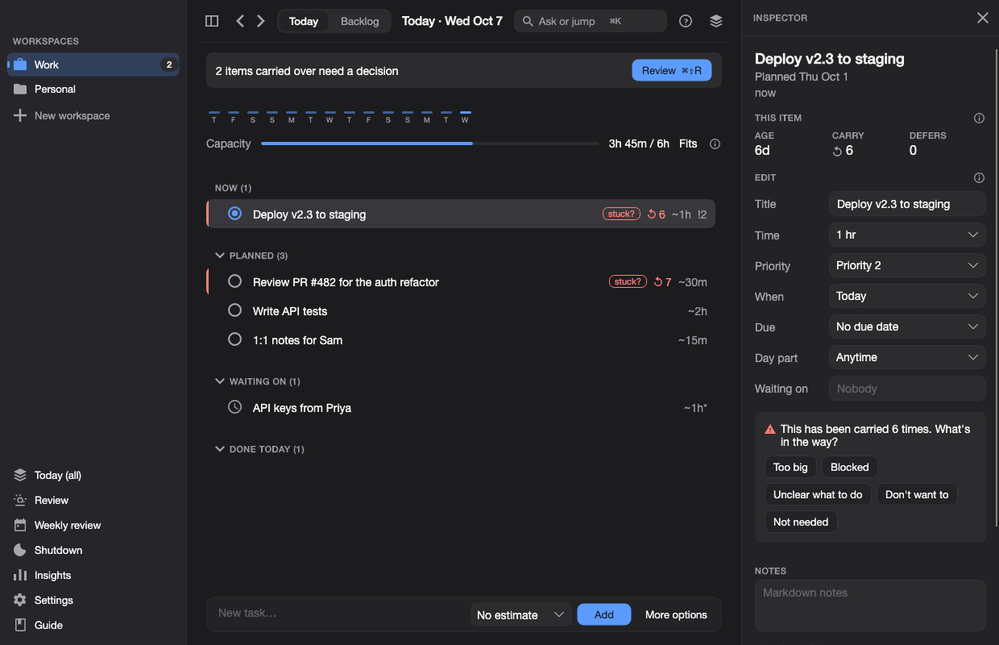 | 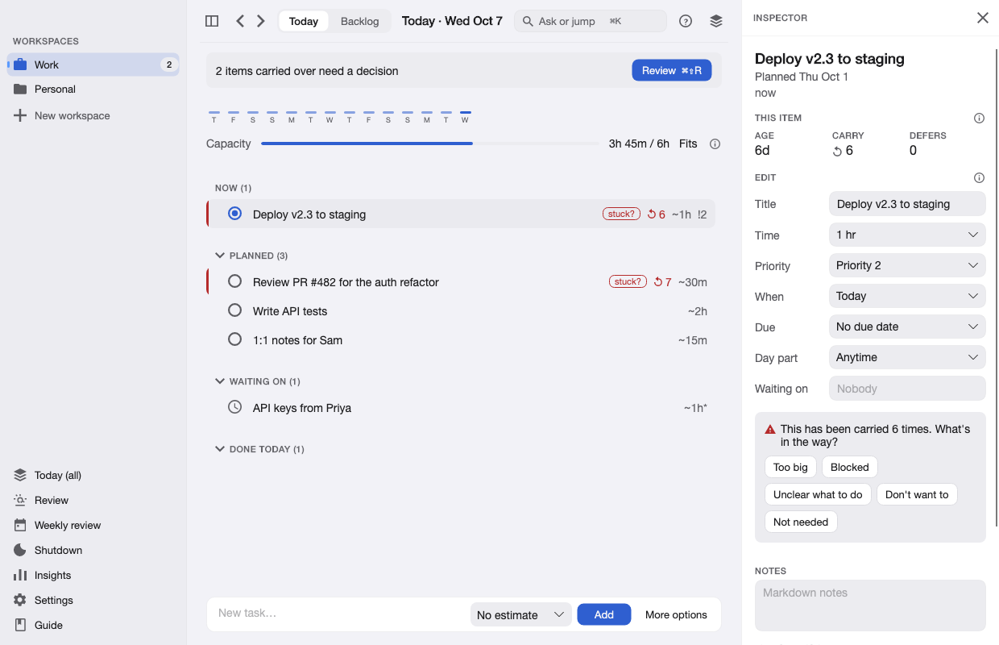 |

<details>
<summary><strong>More Views & Features (Morning Review, Kanban, Timeline, Command Bar, Quick Capture)</strong></summary>
<br/>

### Morning Review & Decision Prompts

When tasks roll over, morning review prompts you to make an active decision (do today, defer, break down, or drop):

|                    Morning Review Card                     |                        Review Decision Prompt                        |
| :--------------------------------------------------------: | :------------------------------------------------------------------: |
| 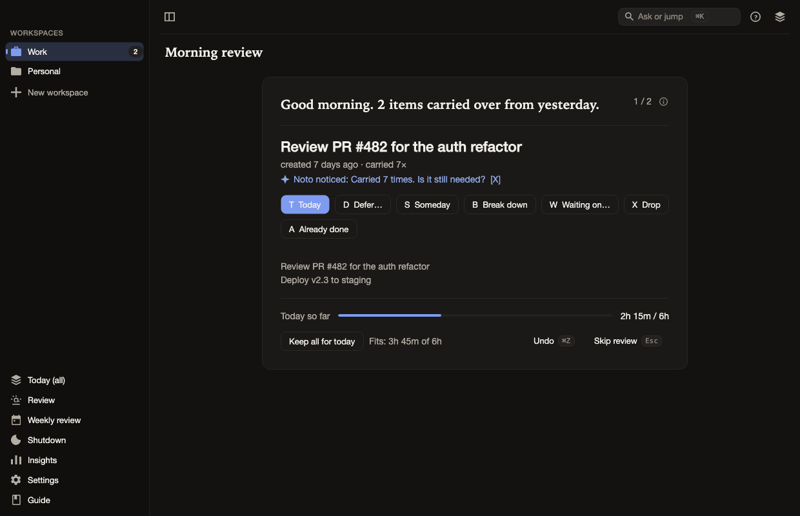 | 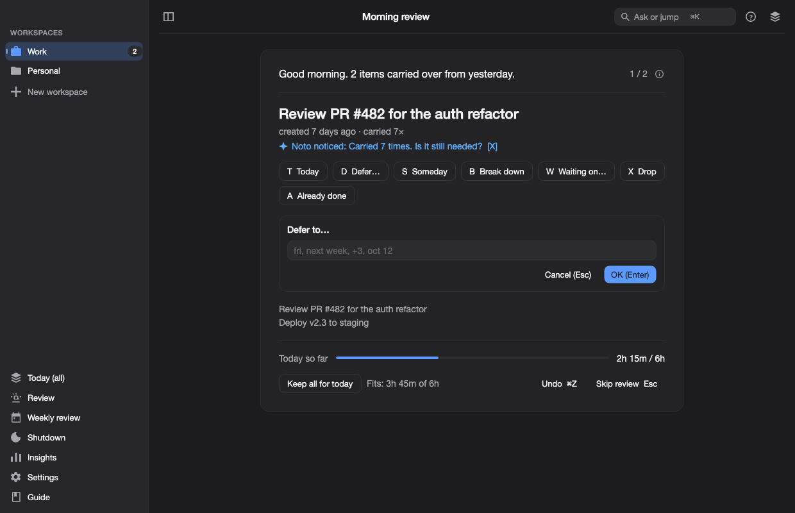 |

### Workspace Layouts & Presets

Each workspace can choose its own view mode (Kanban board, deadline timeline, or daily habit tracker):

|                    Kanban Board                    |                     Timeline / Deadlines                      |                    Habits                     |
| :------------------------------------------------: | :-----------------------------------------------------------: | :-------------------------------------------: |
| 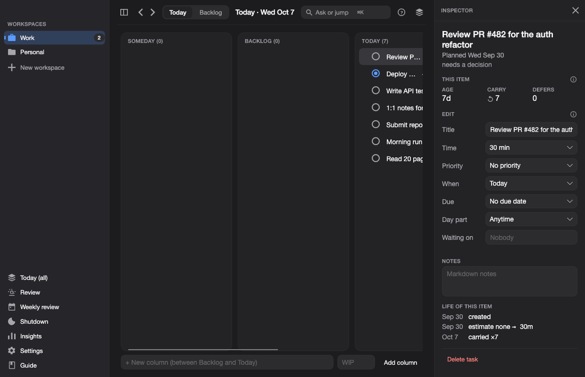 | 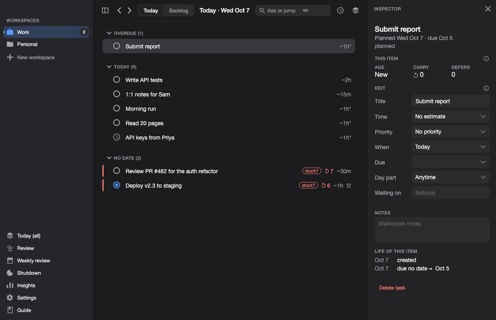 | 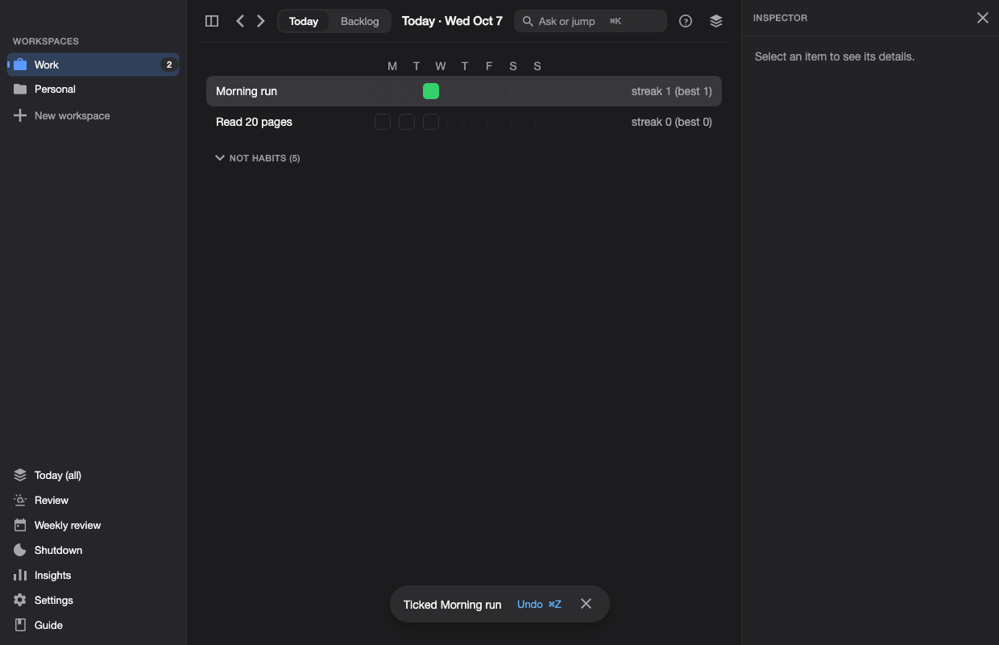 |

### Quick Capture & Command Palette

Quickly create tasks with estimates or open the command palette (`⌘K`) to jump anywhere:

|                   Command Bar (`⌘K`)                   |                         Detailed Quick Capture                          |
| :----------------------------------------------------: | :---------------------------------------------------------------------: |
| 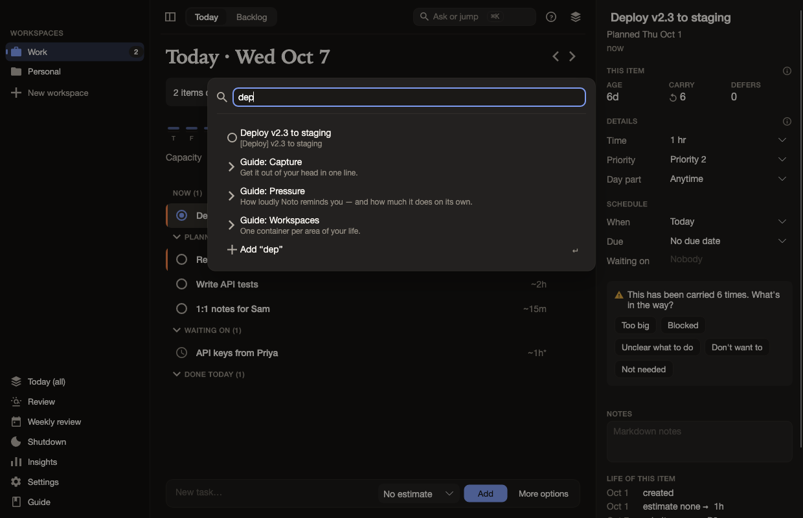 | 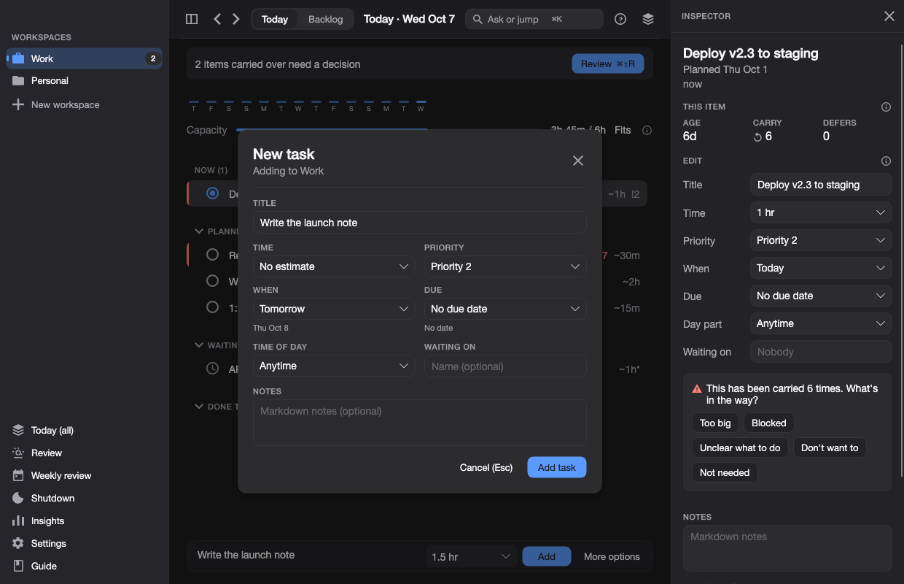 |

### Guide & Insights

|                In-App Documentation                |                Insights & Velocity                |
| :------------------------------------------------: | :-----------------------------------------------: |
| 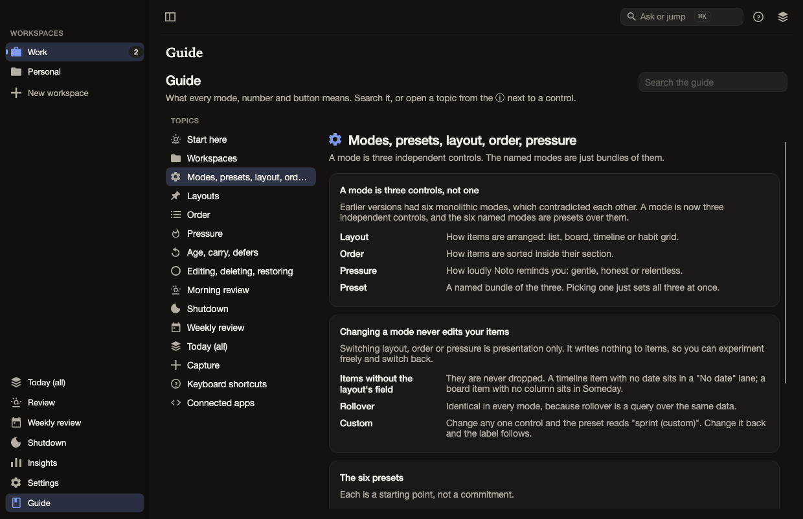 | 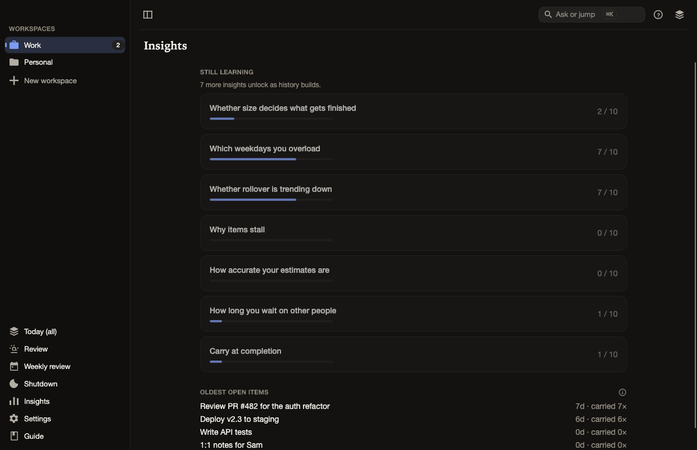 |

</details>

## Prerequisites

Everything is managed by [mise](https://mise.jdx.dev). You don't install .NET yourself.

```sh
brew install mise          # or see https://mise.jdx.dev/getting-started.html
cd noto
mise trust                 # approve mise.toml
mise install               # installs the .NET 10 SDK pinned in mise.toml
```

Run all tooling through mise: `mise run <task>` or `mise exec -- dotnet <args>`. (If your shell has `mise activate` set up, plain `dotnet` also works inside the repo.)

Docker is only needed for the server container. Targets: the desktop app is developed and checked on macOS (Apple Silicon); the code builds for Windows and Linux but those platform layers are stubs (see status doc).

## Build and test

```sh
mise run build             # dotnet build Noto.sln
mise run test              # dotnet test Noto.sln (about 850 tests, ~30 s)
mise run test:release      # -c Release; the timing budgets are written for Release
mise run screenshots       # render headless UI screenshots to dist/ui-preview
mise run desktop           # run the desktop app
```

Run a single project's tests, optionally with a filter:

```sh
PROJECT=Noto.Core.Tests mise run test:one
PROJECT=Noto.Data.Tests FILTER=Break_down mise run test:one
```

`mise tasks` lists everything (`restore`, `screenshots`, `clean`, `outdated`, `publish:desktop`, `ci`, …).

## Formatting and linting

[CSharpier](https://csharpier.com) is the formatter; it is pinned as a local .NET tool in
`.config/dotnet-tools.json`, so nothing is installed globally — `mise run restore` (or any of the tasks below)
restores it.

```sh
mise run fmt               # rewrite all C# with CSharpier
mise run fmt:check         # verify only (use in CI)
mise run lint              # dotnet format: whitespace, style and analyzer rules (no writes)
mise run lint:fix          # apply those fixes
mise run ci                # fmt:check + lint + build + test
```

## Run the desktop app

```sh
mise exec -- dotnet run --project src/Noto.Desktop
```

Options:

| Flag                | Effect                                                    |
| ------------------- | --------------------------------------------------------- |
| `--data-dir <path>` | Use a different data directory (handy for a throwaway DB) |
| `--capture`         | Start with the quick-capture panel open                   |

Your data lives in a single SQLite file, `noto.db`, in:

- macOS: `~/Library/Application Support/Noto/`
- Windows / Linux: the user's application-data folder, under `Noto/`

The database is created and migrated on first launch. Delete the folder to start fresh.

### Open in an IDE

Open `Noto.sln` in Rider, Visual Studio, or VS Code (C# Dev Kit). Set `src/Noto.Desktop` as the startup project.

If the editor floods you with "does not exist in the current context" / "no defining declaration found
for partial method" errors while `mise run build` is clean, its language server is not running the source
generators (`CommunityToolkit.Mvvm` and `Avalonia.Generators`) — restart it, and if that fails delete every
`obj/` and `bin/` and reload. See `CLAUDE.md › Source generators`.

### Install (publish a self-contained build)

To package and install a native Mac `.app` bundle (which includes the custom app icon and can be launched from `/Applications`):

```sh
mise run install:mac
```

If you only want to build the plain executable binaries for other platforms (e.g. Windows/Linux or raw Mac binary):

```sh
mise run publish:desktop     # Uses TARGET_RID=osx-arm64 by default
./dist/noto-desktop/Noto.Desktop
```

You can set `TARGET_RID` to `osx-x64`, `win-x64`, or `linux-x64` as needed. Note that the plain desktop build produces a folder (about 115 MB) without an installer or code signing. macOS features that need permissions (notifications, capture-with-context) will prompt on first use, and an unsigned build may need to be allowed under System Settings > Privacy & Security.

## Run the sync server (optional)

The native app works fully offline and needs no server. The server adds sync across devices and the connected-apps gateway for the web client.

Secrets are required and have no defaults; the server refuses to start without them.

Copy `.env.sample` to `.env` at the repo root and fill it in. The server reads the first `.env` it finds in its working directory, then in the parent folders of the binary, so the command below picks up the repo-root file. Real environment variables override the file, and `.env` is git-ignored.

```sh
cp .env.sample .env
# set JWT_SIGNING_KEY (openssl rand -hex 32) and PUBLIC_URL in .env
mise exec -- dotnet run --project src/Noto.Server --urls http://localhost:8080
```

With no `DATABASE_URL` it uses SQLite under `DATA_DIR` (default `./noto-data`).

| Variable                                  | Purpose                                                              |
| ----------------------------------------- | -------------------------------------------------------------------- |
| `JWT_SIGNING_KEY` (required)              | Signs access tokens; at least 32 characters                          |
| `PUBLIC_URL` (required)                   | Absolute http(s) URL of the server                                   |
| `DATABASE_URL` / `DB`                     | `postgresql://...` for Postgres; `DB=sqlite` (default without a URL) |
| `DATA_DIR`                                | SQLite location (default `./noto-data`)                              |
| `REGISTRATION`                            | `closed` (default), `invite` (needs `INVITE_CODES`), or `open`       |
| `INVITE_CODES`                            | Comma-separated sign-up codes, each at least 16 characters           |
| `PORT`                                    | Listen port in the container (default 8080)                          |
| `CORS_ORIGINS`                            | Comma-separated allowed browser origins                              |
| `<PROVIDER>_CLIENT_ID` / `_CLIENT_SECRET` | Enable the gateway OAuth for GitHub, Slack, Atlassian, ...           |

More options (rate limits, Argon2 cost, `GATEWAY_ALLOW_PRIVATE_HOSTS`) are in `src/Noto.Server/Config/ServerConfig.cs`.

To get the `<PROVIDER>_CLIENT_ID` and secret for each connected app, see [`docs/12-connected-apps-setup.md`](docs/12-connected-apps-setup.md).

### Docker

```sh
cd src/Noto.Server
export POSTGRES_PASSWORD=change-me JWT_SIGNING_KEY="$(openssl rand -hex 32)" PUBLIC_URL=http://localhost:8080
docker compose up --build
```

Or build the image alone from the repository root: `docker build -f src/Noto.Server/Dockerfile -t noto/server .`. The Docker image and the Postgres provider have not been exercised yet (see status doc).

### Single binary

```sh
mise exec -- dotnet publish src/Noto.Server -c Release -r osx-arm64 -p:PublishSingleFile=true -o dist/noto-server
```

## Repository layout

```
src/
  Noto.Core        domain: models, time, commands, derivations, insights, import/export (no UI, no I/O)
  Noto.Data        SQLite repositories, embedded SQL migrations, FTS5 search, caches
  Noto.Sync        client sync: HLC op-log, merger, transport
  Noto.Providers   connected apps: GitHub, Jira, Linear, Slack, ... previews and live links
  Noto.Platform    OS abstractions (hotkey, keyring, notifications) + macOS implementations
  Noto.App         Avalonia UI: view models, views, controls, themes
  Noto.Desktop     desktop host (composition root)
  Noto.Server      ASP.NET Core sync API + connected-apps gateway
tests/             one test project per src project
docs/              design docs and status
```

New SQL migrations go in `src/Noto.Data/Migrations/` as `NNNN_name.sql` (embedded resources, applied in numeric order; ranges are noted in `CLAUDE.md`).

## Syncing: one gotcha

If you wire up the data layer yourself, create one `HybridClock` per device and pass the same instance to both `SqliteUnitOfWork` and `CommandBus`. Without it nothing is recorded for sync. Details in [`CLAUDE.md`](CLAUDE.md).
