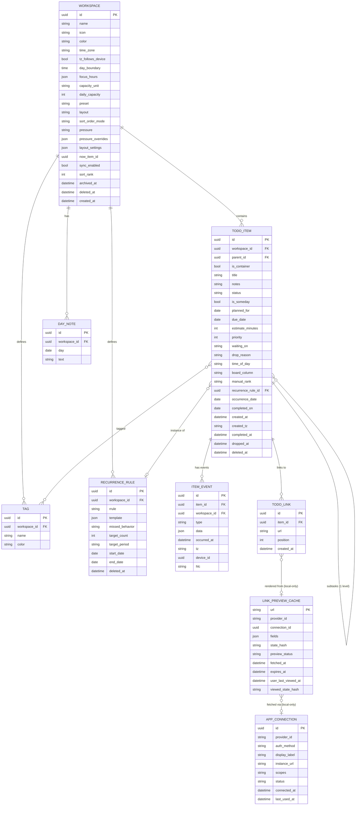

# Noto — Domain Model & Data Architecture

This doc is the source of truth for entities, time semantics and derived metrics. Other docs reference it.

**Three rules shape everything here:**

1. **Current state + append-only events are the only truth.** Item rows hold current state. `ItemEvent` rows record what happened. Age, carry, day stats, streaks and insights are **derived** from these two, never stored as synced data.
2. **Nothing is written at day change.** Rolling over is a query (section 5). That makes it idempotent, gap-proof and multi-device safe by construction.
3. **Every date the user sees is a _logical date_**, computed from a UTC instant, a time zone and the workspace's day boundary (section 3).

---

## 1. Entity Relationship Diagram



### Synced vs local-only

| Synced (user data)                                                                                    | Local-only (never leaves the device)                                                                                                                                                 |
| ----------------------------------------------------------------------------------------------------- | ------------------------------------------------------------------------------------------------------------------------------------------------------------------------------------ |
| `workspace`, `todo_item`, `item_event`, `recurrence_rule`, `tag`, `todo_tag`, `day_note`, `todo_link` | `app_connection` (secrets are in the OS keyring, not SQLite), `link_preview_cache`, `day_stats_cache`, `item_metrics_cache`, `conflict_log`, `pending_ops`, `sync_state`, `ui_state` |

Link previews are **never synced**. They contain private third-party content fetched with this device's credentials ([10-connected-apps.md](10-connected-apps.md)). The URL itself (`todo_link`) is user data and does sync.

There is **no `User` entity on the client.** Accounts exist only on the sync server ([06-api-design.md](06-api-design.md)). A local install has a random `device_id`.

---

## 2. Core Entities

### 2.1 TodoItem

```csharp
public sealed class TodoItem
{
    public Guid Id { get; init; }
    public Guid WorkspaceId { get; set; }
    public Guid? ParentId { get; set; }            // one level of subtasks
    public bool IsContainer { get; set; }          // true once "broken down"

    // Content
    public string Title { get; set; } = "";
    public string? Notes { get; set; }             // Markdown

    // Lifecycle
    public ItemStatus Status { get; set; }         // Open, Waiting, Done, Dropped
    public bool IsSomeday { get; set; }
    public DateOnly? PlannedFor { get; set; }      // the logical day the user intends to do it
    public DateOnly? DueDate { get; set; }         // external deadline (optional in every mode)
    public string? WaitingOn { get; set; }         // person name or URL
    public DropReason? DropReason { get; set; }

    // Planning
    public int? EstimateMinutes { get; set; }
    public int Priority { get; set; }              // 0 none, 1 low, 2 medium, 3 high, 4 critical
    public TimeOfDay? TimeOfDay { get; set; }      // Morning, Midday, Afternoon, Evening
    public string? BoardColumn { get; set; }       // user-defined board column id (null = derived)
    public string ManualRank { get; set; } = "";   // fractional index for manual order (sync-safe)

    // Recurrence
    public Guid? RecurrenceRuleId { get; set; }
    public DateOnly? OccurrenceDate { get; set; }

    // Timestamps (UTC instants)
    public DateTimeOffset CreatedAt { get; init; }
    public string CreatedTz { get; init; } = "";   // IANA zone at creation
    public DateOnly? CompletedOn { get; set; }     // logical day credited (may be "yesterday")
    public DateTimeOffset? CompletedAt { get; set; }
    public DateTimeOffset? DroppedAt { get; set; }
    public DateTimeOffset? DeletedAt { get; set; } // tombstone; see 05 › Sync
}

public enum ItemStatus { Open, Waiting, Done, Dropped }
public enum DropReason { NotNeeded, SomeoneElseDidIt, NotWorthIt, Other }
public enum TimeOfDay { Morning, Midday, Afternoon, Evening }
```

**Invariants** (enforced in `Noto.Core` commands, checked by tests):

| #   | Invariant                                                                                                 |
| --- | --------------------------------------------------------------------------------------------------------- |
| I1  | `IsSomeday ⇒ PlannedFor == null && Status == Open`                                                        |
| I2  | `Status == Done ⇔ CompletedOn != null && CompletedAt != null`                                             |
| I3  | `Status == Dropped ⇔ DroppedAt != null`                                                                   |
| I4  | `Status == Waiting ⇒ WaitingOn != null` (`PlannedFor` is kept so the item can return to it)               |
| I5  | `ParentId != null ⇒ parent.IsContainer && parent.ParentId == null` (one level only)                       |
| I6  | `IsContainer ⇒ PlannedFor == null` (containers are never planned; their subtasks are)                     |
| I7  | `RecurrenceRuleId != null ⇔ OccurrenceDate != null`, and `Id == UUIDv5(RecurrenceRuleId, OccurrenceDate)` |

**Item states the UI exposes:**

| State          | Condition                                  | Where it appears                                     |
| -------------- | ------------------------------------------ | ---------------------------------------------------- |
| Planned        | `Open`, `PlannedFor ≤ today`               | Today › Planned (or Now)                             |
| Needs decision | `Open`, `PlannedFor < today`               | Today › carry-over banner / Review                   |
| Scheduled      | `Open`, `PlannedFor > today`               | That future day, Timeline                            |
| Unscheduled    | `Open`, `PlannedFor == null`, `!IsSomeday` | Backlog view, Board columns                          |
| Someday        | `Open`, `IsSomeday`                        | Someday list, Weekly Review                          |
| Waiting        | `Waiting`                                  | Today › Waiting on (if `PlannedFor ≤ today` or null) |
| Done / Dropped | terminal                                   | Done today, history, Logbook                         |

### 2.2 Subtasks ("Break down")

- Breaking down item P sets `P.IsContainer = true`, `P.PlannedFor = null` and creates 2–5 children. The first child inherits P's former `PlannedFor`. The others are Unscheduled unless the user plans them.
- Carry that P had accrued stays on P (it's history). From then on, carry accrues only on children.
- When the last open child becomes Done, P becomes Done (`CompletedOn` = that day), with an undo toast. If every child is Dropped, P asks: done or drop?
- Containers show `n/m` progress and are never in Today themselves. Children in Today show P's title as a breadcrumb.

### 2.3 Workspace

| Field                                             | Meaning                                                                                                         |
| ------------------------------------------------- | --------------------------------------------------------------------------------------------------------------- |
| `time_zone`, `tz_follows_device`                  | IANA zone. If `tz_follows_device` (default), "today" uses the device's current zone (section 3).                |
| `day_boundary`                                    | Local wall time when the logical day starts (default `00:00`, e.g. `04:00` for night owls).                     |
| `focus_hours`                                     | Optional `{days: [Mon..Fri], start: "09:00", end: "18:00"}`. Used by the Today (all) lens and capture defaults. |
| `capacity_unit`, `daily_capacity`                 | `minutes` (default 360) or `items`.                                                                             |
| `preset`, `layout`, `sort_order_mode`, `pressure` | See [03-modes-and-workspaces.md](03-modes-and-workspaces.md).                                                   |
| `pressure_overrides`                              | Optional custom thresholds `{warm, hot, stale, stuck_carry, stuck_defers}`.                                     |
| `layout_settings`                                 | Per-layout settings keyed by layout: board columns + WIP limits, timeline range, habit grid range.              |
| `now_item_id`                                     | The single **Now** item (synced; the last writer wins).                                                         |

### 2.4 ItemEvent (append-only history)

```csharp
public sealed class ItemEvent
{
    public Guid Id { get; init; }              // random, or UUIDv5 for idempotent system events
    public Guid ItemId { get; init; }
    public Guid WorkspaceId { get; init; }
    public ItemEventType Type { get; init; }
    public JsonDocument? Data { get; init; }
    public DateTimeOffset OccurredAt { get; init; }   // UTC instant
    public string Tz { get; init; } = "";             // IANA zone in effect when recorded
    public Guid DeviceId { get; init; }
    public string Hlc { get; init; } = "";            // hybrid logical clock, see 05
}

public enum ItemEventType
{
    Created,            // {planned_for, is_someday, source: "inline"|"capture"|"import"|"recurrence"|"breakdown"}
    TitleChanged,       // {from, to}
    NotesChanged,
    PriorityChanged,    // {from, to}
    EstimateChanged,    // {from, to}
    Planned,            // {from, to, kind: "plan"|"keep_today"|"defer"|"unschedule"}
    SomedayChanged,     // {to: bool}
    WaitingStarted,     // {on}
    WaitingEnded,       // {via: "manual"|"link", url?}
    Completed,          // {completed_on}
    Reopened,
    Dropped,            // {reason, note?}
    Restored,
    StuckReasonGiven,   // {reason: "too_big"|"blocked"|"unclear"|"dont_want_to"|"not_needed"}
    BrokenDown,         // {child_ids}
    FocusStarted,
    FocusStopped,       // {minutes}
    ColumnChanged,      // {from, to}
    DueDateChanged,     // {from, to}
    MovedWorkspace,     // {from, to}
    LinkStateChanged,   // {url, provider, from_state, to_state}  (id = UUIDv5(item, url, to_state_hash))
    Deleted
}
```

Events are immutable. They sync as inserts, so they can't conflict. Every command in `Noto.Core` writes **state change + event in one SQLite transaction**.

`LinkStateChanged` is observed independently by every device that has a connection. Its deterministic id makes the copies collapse into one event after sync.

### 2.5 RecurrenceRule

| Field                            | Meaning                                                                                                                                                                 |
| -------------------------------- | ----------------------------------------------------------------------------------------------------------------------------------------------------------------------- |
| `rrule`                          | RFC 5545 subset: `FREQ=DAILY/WEEKLY/MONTHLY`, `INTERVAL`, `BYDAY`, `BYMONTHDAY`.                                                                                        |
| `template`                       | Title, notes, estimate, priority, time_of_day, tag ids. Editing it affects **instances not yet generated** (UC-06).                                                     |
| `missed_behavior`                | `carry` (task-like: e.g. "weekly report"; a missed instance carries like any item) or `skip` (habit-like: a missed day is recorded as missed, and no instance carries). |
| `target_count` / `target_period` | Flex streak target, e.g. 5 per `week`. The default is 1 per scheduled occurrence.                                                                                       |

**Instance generation** is lazy and deterministic:

- Whenever a workspace's Today is computed, generate the instance for each rule occurring on `today` if it doesn't exist. Its id is `UUIDv5(rule_id, occurrence_date)`, so two devices generating the same instance produce the same row, and sync merges them.
- `carry` rules: if occurrences were missed while the app was closed, only the **most recent** missed occurrence is created (planned for its own date, so it carries). Earlier ones are reported as _missed_ (derived), not materialized. Nobody needs three copies of "write standup notes".
- `skip` rules: past occurrences are never created. "Missed" = scheduled occurrence date with no Done instance (derived).
- No future instances are created in advance.

---

## 3. Time Semantics

All instants are stored as UTC (`DateTimeOffset`). Every user-facing date is a **logical date**:

```
logical_date(instant, tz, boundary) = DateOnly( toLocal(instant, tz) − boundary )
today(ws)                           = logical_date(now, effective_tz(ws), ws.day_boundary)
effective_tz(ws)                    = ws.tz_follows_device ? device_tz : ws.time_zone
```

| Rule                 | Behavior                                                                                                                                                                              |
| -------------------- | ------------------------------------------------------------------------------------------------------------------------------------------------------------------------------------- |
| History never shifts | An event's logical date uses the **event's own** `Tz`, not today's zone. Traveling doesn't rewrite the past.                                                                          |
| Travel               | "Today" follows the device zone (when `tz_follows_device`). Flying east can start a new logical day early. That's fine: the day change only changes queries.                          |
| DST                  | `day_boundary` is a local wall time. If the boundary falls in a skipped hour, the day starts at the next valid instant. If it's ambiguous (falls back), the first occurrence is used. |
| Day boundary edits   | Changing `day_boundary` affects only logical dates computed from then on. Stored `PlannedFor`/`CompletedOn` dates are dates, not instants, so they don't move.                        |
| Implementation       | `TimeZoneInfo` with IANA ids (ICU on all targets, including WASM). An injected `IClock` makes everything testable.                                                                    |

---

## 4. Derived Metrics

All of these are pure functions over `TodoItem` + `ItemEvent` + `today`. They're cached locally in `item_metrics_cache` / `day_stats_cache`, and the caches are invalidated from the earliest logical date touched by any local or synced write.

### 4.1 Age, Carry, Defers

```
state_at_start_of(item, D)  = replay item's events whose logical_date < D

age(item)    = (end_date ?? today) − logical_date(item.CreatedAt, item.CreatedTz)
               where end_date = CompletedOn ?? logical_date(DroppedAt)
               (0 is shown as "New"; it freezes at completion/drop; continues after Restore)

carry(item)  = | { D : created_date < D ≤ (end_date ?? today),
                       s = state_at_start_of(item, D),
                       s.Status == Open ∧ ¬s.IsSomeday ∧ ¬s.IsContainer
                       ∧ s.PlannedFor != null ∧ s.PlannedFor < D } |

defers(item) = count(Planned events where kind == "defer")
```

| Scenario                                                | Age                                                   | Carry                               |
| ------------------------------------------------------- | ----------------------------------------------------- | ----------------------------------- |
| Created today, planned today                            | 0 ("New")                                             | 0                                   |
| Created yesterday for yesterday, still open today       | 1                                                     | 1                                   |
| Created Mon for Mon, open on Fri (app unopened Tue–Thu) | 4                                                     | 4 (each missed day counts, no gaps) |
| Created 10 days ago, deferred to today, open today      | 10                                                    | carry from before the defer only    |
| Waiting Tue–Thu, back to Open Fri                       | grows                                                 | does not grow Tue–Thu               |
| Someday for 3 weeks, then planned                       | grows                                                 | does not grow while Someday         |
| Created 5 days ago, completed today                     | freezes at 5                                          | freezes                             |
| "Already done" chosen in morning review                 | `CompletedOn` = yesterday                             | today is not counted                |
| Recurring instance                                      | from its own `CreatedAt` (each instance starts fresh) | normal rules                        |

This replaces the old `AgeDays` property, which ignored day boundaries, used the local `DateTime.Now` and never froze. It also replaces the stored `age_days` column. Defers don't reset carry. A defer only stops carry from growing until the new date.

### 4.2 Pressure state

```
pressure_state(item, ws) = threshold(ws.pressure, ws.pressure_overrides) applied to carry(item)
stuck(item, ws)          = carry ≥ stuck_carry ∨ defers ≥ stuck_defers
```

The thresholds are defined once, in [03 › Pressure](03-modes-and-workspaces.md#pressure).

### 4.3 Day stats (replaces stored DaySnapshot)

For workspace `ws` and logical date `D`:

| Metric            | Definition                                                                                                                                    |
| ----------------- | --------------------------------------------------------------------------------------------------------------------------------------------- |
| `carried_in`      | Items with `state_at_start_of(D)`: Open, ¬Someday, `PlannedFor < D`                                                                           |
| `planned_in`      | Items with `state_at_start_of(D)`: Open, ¬Someday, `PlannedFor == D`                                                                          |
| `added`           | Items created on D with `PlannedFor == D`                                                                                                     |
| `done`            | Items with `CompletedOn == D`                                                                                                                 |
| `dropped`         | Items dropped on D                                                                                                                            |
| `deferred_out`    | Items with a defer event on D moving them past D                                                                                              |
| `open_at_end`     | Items with `state_at_start_of(D+1)`: Open, ¬Someday, `PlannedFor ≤ D`, excluding items later credited with `CompletedOn ≤ D` ("Already done") |
| `completion_rate` | `done / (done + open_at_end)`. Undefined (not 0) when the denominator is 0.                                                                   |
| `planned_minutes` | Σ estimates (or the historical median when an estimate is missing) of `carried_in + planned_in + added`                                       |

**Time travel** to day D renders exactly these sets, so any past day can be reconstructed and nothing is ever archived away.

### 4.4 Workspace stats & insights

| Stat                         | Definition                                                                                                                   |
| ---------------------------- | ---------------------------------------------------------------------------------------------------------------------------- |
| `completion_streak`          | Consecutive logical days with `completion_rate == 1`. Days with an undefined rate are skipped (they don't break the streak). |
| `rollover_rate (7d)`         | Σ `carried_in` / Σ (`carried_in + planned_in + added`) over 7 days                                                           |
| `median_carry_at_completion` | Over items completed in the period                                                                                           |
| `stale_count`                | Open items in the `stale` pressure state                                                                                     |
| `stuck_reason_mix`           | Distribution of `StuckReasonGiven.reason` in the period                                                                      |
| `estimate_accuracy`          | Median of `focused_minutes / EstimateMinutes` per size bucket (items with both)                                              |
| `same_day_rate_by_size`      | Share of items done on the day they were first planned, by estimate bucket                                                   |
| `weekday_load`               | Mean planned vs done per weekday                                                                                             |
| `waiting_duration_by_person` | Median days in Waiting grouped by `WaitingOn`                                                                                |
| `pace_forecast`              | For a day with N planned items: median `done` on the 10 most similar past days (same weekday, similar N)                     |

Insights appear only once the sample size is ≥ 10.

### 4.5 Habit stats (rules with `missed_behavior = skip`)

- **Flex streak:** consecutive `target_period`s in which done instances ≥ `target_count`. The current, unfinished period counts as long as the target is still reachable.
- **Longest streak**, **completion heatmap** (scheduled / done / missed per date). All derived. Nothing streak-related is stored.

---

## 5. Day Change (replaces the "Rollover Algorithm")

At a logical day boundary, Noto **writes nothing** except:

1. Generating today's recurrence instances (deterministic ids; section 2.5).
2. Invalidating `day_stats_cache` for yesterday and today.
3. Showing the UI banner and Review prompt if `needs_decision > 0`.

```
today_view(ws, today):
    now        = ws.now_item_id (if Open)
    planned    = Open ∧ ¬container ∧ PlannedFor ≤ today        -- PlannedFor < today ⇒ "needs decision"
    waiting    = Waiting ∧ (PlannedFor == null ∨ PlannedFor ≤ today)
    done_today = CompletedOn == today
```

Properties that fall out of this design:

- **Idempotent:** queries can't double-apply.
- **Gaps:** a user who is away 3 days returns to items whose carry already includes those 3 days. Stats for those days are computed on demand.
- **Multi-device:** there's no device-side rollover to collide.
- **Late data:** an edit from a device that was offline, back-dated by its event logical date, simply invalidates caches from that date.

A **decision** is any command that changes `PlannedFor`, `IsSomeday`, `Status` or `IsContainer` on an item that needs a decision. "Keep for today" sets `PlannedFor = today` (kind `keep_today`). Carry already counted today, and the item stops needing a decision.

---

## 6. Links

- `todo_link` (synced): a normalized URL (scheme, host lowercased, tracking params like `utm_*` stripped) plus its position. A todo's links are detected from its title and notes, and can also be added explicitly.
- `link_preview_cache` (local-only): keyed by normalized URL, so the same PR referenced in three todos is fetched once. `state_hash` summarizes actionable state (e.g. PR `merged`, ticket `In Review`). The UI shows a change dot when `state_hash != viewed_state_hash`.
- `app_connection` (local-only): metadata only. Secrets live in the OS keyring under service `app.noto.connections`, account `<connection id>`. See [10-connected-apps.md](10-connected-apps.md).
