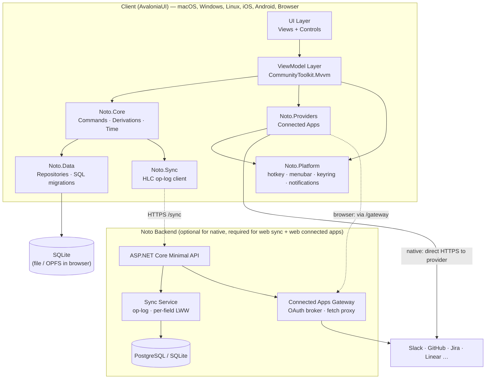
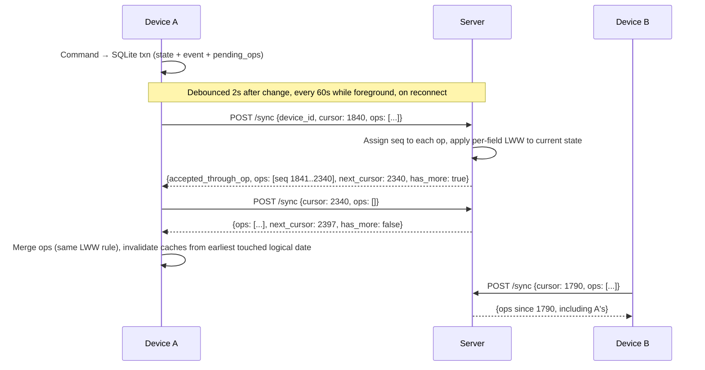

# Noto — Technical Architecture

## Architecture Overview



---

## Solution Structure

```
Noto/
├── src/
│   ├── Noto.Core/                    # net10.0 — no UI, no I/O
│   │   ├── Models/                   # TodoItem, Workspace, ItemEvent, RecurrenceRule, ...
│   │   ├── Time/                     # IClock, LogicalDate, DayBoundary, tz handling
│   │   ├── Commands/                 # Plan, KeepToday, Defer, Someday, BreakDown, Wait, Drop, Complete, ...
│   │   │                             #   each = state change + ItemEvent in one transaction
│   │   ├── Derivations/              # Carry/Age/Defers, DayStats, Streaks, Insights, PaceForecast
│   │   ├── Recurrence/               # RRULE subset, deterministic instance generation
│   │   ├── Presets/                  # Layout/Order/Pressure definitions, built-in presets
│   │   └── Interfaces/               # IItemRepository, IEventStore, IOpLog, IKeyring, ...
│   │
│   ├── Noto.Data/                    # Microsoft.Data.Sqlite + hand-written SQL (AOT-safe)
│   │   ├── Migrations/              # 0001_init.sql, 0002_...sql (embedded resources)
│   │   ├── Repositories/
│   │   ├── Caches/                  # day_stats_cache, item_metrics_cache, link_preview_cache
│   │   └── Seed/                    # built-in presets, onboarding templates
│   │
│   ├── Noto.Sync/                    # client sync
│   │   ├── Hlc.cs                   # hybrid logical clock
│   │   ├── OpLog.cs                 # pending_ops capture from commands
│   │   ├── SyncClient.cs            # push/pull with cursor + pagination
│   │   ├── Merger.cs                # per-field LWW apply, conflict_log for text fields
│   │   └── Bootstrap.cs             # new device / re-enabled workspace snapshot load
│   │
│   ├── Noto.Providers/               # Connected Apps
│   │   ├── IAppProvider.cs
│   │   ├── ProviderRegistry.cs      # URL matching → (provider, connection)
│   │   ├── PreviewService.cs        # detection, cache-first, rate limit, live-link state hash
│   │   ├── Transport/
│   │   │   ├── DirectTransport.cs   # native: HTTPS straight to provider
│   │   │   └── GatewayTransport.cs  # browser: via Noto backend /gateway
│   │   ├── Auth/                    # OAuth2 (PKCE + loopback), token refresh, PAT
│   │   ├── Providers/               # GitHub, Jira, Linear, Slack, GitLab, Notion, Confluence, OpenGraph
│   │   └── CustomApp/               # JSONPath mapper
│   │
│   ├── Noto.Platform/                # interfaces + per-OS implementations
│   │   ├── Abstractions/            # IGlobalHotkey, IMenuBar, IKeyring, ICaptureContext,
│   │   │                            # INotifications, IReduceMotion, IFocusWindow
│   │   ├── MacOS/                   # Carbon hotkey, NSStatusItem via TrayIcon/NativeMenu, Keychain, Apple Events
│   │   ├── Windows/                 # RegisterHotKey, Credential Manager (DPAPI), toast notifications
│   │   ├── Linux/                   # libsecret; X11 hotkey (Wayland: portal / user-bound shortcut)
│   │   ├── iOS/ Android/            # Keychain / AndroidKeyStore, share targets, widgets
│   │   └── Browser/                 # Web Crypto + IndexedDB keyring, no hotkey
│   │
│   ├── Noto.App/                     # Avalonia shared UI
│   │   ├── ViewModels/              # Shell, Today, Review, Shutdown, Inspector, CommandBar, Backlog,
│   │   │                            # Board, Timeline, HabitGrid, WeeklyReview, Insights, Settings
│   │   ├── Views/
│   │   ├── Controls/                # CarryGlyph, CapacityBar, DayStrip, LinkChip, LinkPreviewCard,
│   │   │                            # TokenInput, HabitGrid, BoardColumn, TimelineLane, UndoToast
│   │   ├── Themes/                  # token dictionaries (Dark/Light), workspace accent
│   │   └── Assets/
│   │
│   ├── Noto.Desktop/                 # macOS / Windows / Linux host
│   ├── Noto.Browser/                 # WASM host
│   ├── Noto.iOS/  Noto.Android/      # mobile hosts
│   │
│   └── Noto.Server/                  # backend (see 06)
│       ├── Endpoints/               # Auth, Sync, Devices, Account, Gateway
│       ├── Sync/                    # op ingest, per-field LWW, seq cursor, snapshot
│       ├── Gateway/                 # OAuth broker, allowlisted fetch proxy, OpenGraph (SSRF-safe)
│       └── Data/                    # EF Core 10 (server only; no AOT constraint)
│
├── tests/
│   ├── Noto.Core.Tests/              # derivations, time semantics, invariants (property-based)
│   ├── Noto.Data.Tests/
│   ├── Noto.Sync.Tests/              # multi-replica convergence simulations
│   ├── Noto.Providers.Tests/         # recorded HTTP fixtures per provider
│   └── Noto.Server.Tests/
│
├── docs/
├── Noto.sln
└── Directory.Build.props
```

---

## Technology Choices

| Layer                | Technology                                                                   | Rationale                                                                                                       |
| -------------------- | ---------------------------------------------------------------------------- | --------------------------------------------------------------------------------------------------------------- |
| **Runtime**          | .NET 10 (LTS)                                                                | .NET 8 support ends Nov 2026. 10 is the current LTS.                                                            |
| **UI Framework**     | Avalonia UI (latest stable 11.x)                                             | One codebase for desktop, browser and mobile.                                                                   |
| **MVVM**             | CommunityToolkit.Mvvm                                                        | Source-generated and AOT-friendly                                                                               |
| **Client DB access** | Microsoft.Data.Sqlite + hand-written SQL behind repositories                 | AOT/trimming-safe on iOS and WASM, where EF Core's AOT support is still partial. The schema is about 15 tables. |
| **Migrations**       | Numbered embedded `.sql` scripts + `schema_version` table                    | Simple, deterministic, identical on every platform                                                              |
| **Browser storage**  | SQLite compiled into the WASM bundle, persisted to OPFS (IndexedDB fallback) | Same SQL on every target. **Spike in Phase 8** (see risk register).                                             |
| **Time**             | `TimeZoneInfo` (IANA ids via ICU), `DateOnly`/`TimeOnly`, injected `IClock`  | No extra dependency; testable                                                                                   |
| **DI**               | Microsoft.Extensions.DependencyInjection                                     | Standard                                                                                                        |
| **Backend**          | ASP.NET Core Minimal APIs + EF Core 10                                       | EF Core is fine on the server                                                                                   |
| **Server DB**        | PostgreSQL (hosted) / SQLite (single-binary self-host)                       |                                                                                                                 |
| **Sync**             | Op-log with per-field LWW ordered by hybrid logical clocks                   | See ADR-07                                                                                                      |
| **Serialization**    | System.Text.Json source generators                                           | AOT-safe                                                                                                        |
| **Testing**          | xUnit + Shouldly (or AwesomeAssertions)                                      | FluentAssertions v8+ requires a paid license for commercial use                                                 |
| **Theming**          | Avalonia Fluent theme + Noto token dictionaries                              | Tokens in [07 › Visual System](07-ui-ux-design.md#11-visual-system--ledger)                                   |

---

## Key Architectural Decisions

### ADR-01: Local-First with Repository Abstraction

**Decision:** Every write goes through a `Noto.Core` command, which writes to local SQLite in one transaction and appends to `pending_ops`. Sync is a separate background process.

- The app works 100% offline. CRUD has no network latency. Sync failures never block the user.
- Commands are the **only** writers, so invariants ([04 › TodoItem](04-domain-model.md#21-todoitem)) and event recording can't be bypassed.

```csharp
public interface IItemRepository
{
    Task<TodoItem?> GetAsync(Guid id);
    Task<IReadOnlyList<TodoItem>> GetTodayAsync(Guid workspaceId, DateOnly today);
    Task<IReadOnlyList<TodoItem>> GetBacklogAsync(Guid workspaceId);
    Task<IReadOnlyList<ItemEvent>> GetEventsAsync(Guid itemId);
    Task<IReadOnlyList<ItemEvent>> GetEventsSinceAsync(Guid workspaceId, DateOnly fromLogicalDate);
}

public interface ICommandBus
{
    Task<CommandResult> SendAsync(ICommand command);   // returns an undo token
}
```

### ADR-02: MVVM with CommunityToolkit.Mvvm

Source generators mean less boilerplate than ReactiveUI. It's AOT-friendly and familiar to any .NET developer.

### ADR-03: Logical Days per Workspace

**Decision:** Every user-facing date is computed from a UTC instant, an IANA time zone and the workspace day boundary. Events store the zone they were recorded in, so history never shifts. See [04 › Time Semantics](04-domain-model.md#3-time-semantics).

### ADR-04: State + Events Are Truth; Everything Else Is Derived

**Decision:** Item rows (current state) and append-only `ItemEvent`s are the only persisted, synced truth. Age, carry, day stats, streaks and insights are computed from them and cached in **local-only** tables. This replaces the earlier "immutable daily snapshot" ADR.

**Rationale:**

- No device-side rollover write, so nothing collides across devices and gaps heal on their own.
- Late-arriving synced edits just invalidate caches from their logical date.
- "Time travel" works for any day forever. Nothing has to be archived to save space; the cache can be dropped and rebuilt.
- Cost: a replay over one item's events per day. Item histories are small, and caches make reads O(1).

### ADR-05: Modes as Presets over Layout × Order × Pressure

**Decision:** Orders, pressure levels and presets are data. Layouts (list, board, timeline, habit grid) are code. Switching never writes to items. See [03](03-modes-and-workspaces.md).

### ADR-06: Connected Apps — Device Keyring Natively, Gateway in the Browser

**Decision:**

- **Native clients** (desktop, mobile) call provider APIs **directly**. Tokens are stored in the OS keyring (macOS Keychain, Windows Credential Manager, libsecret, iOS Keychain, AndroidKeyStore) and only connection metadata is kept in SQLite.
- **Browser client:** browsers can't call provider APIs (CORS) or exchange OAuth codes. Calls go through the backend's **Connected Apps Gateway**, which brokers OAuth and proxies allowlisted requests. Tokens are kept in browser storage, encrypted with a non-extractable Web Crypto key, and sent per request. The gateway **does not store** them.
- Link previews are device-local cache, never synced.

Details: [10 › Web](10-connected-apps.md#web-connected-apps-gateway).

### ADR-07: Sync = Op-Log + Per-Field LWW + HLC + Server Sequence Cursor

**Decision:** Replace whole-entity last-write-wins by client wall clock (it lost concurrent edits and was skew-sensitive) with field-level operations ordered by hybrid logical clocks. See [Sync Architecture](#sync-architecture-when-enabled).

### ADR-08: No EF Core on Clients

**Decision:** Clients use `Microsoft.Data.Sqlite` with explicit SQL. iOS requires full AOT and the browser needs aggressive trimming, and EF Core's precompiled-query AOT support is still experimental. The server keeps EF Core.

### ADR-09: Platform Services Behind Interfaces

**Decision:** Global hotkey, menubar, keyring, capture-with-context, notifications, reduce-motion and the always-on-top focus window are `Noto.Platform` interfaces with native implementations per OS. Avalonia provides none of these portably (except `TrayIcon`/`NativeMenu`). They're budgeted as platform work in the roadmap, not as UI tasks. Unsupported features degrade visibly (e.g. no global hotkey on Wayland without a portal: Settings shows how to bind a system shortcut to `noto --capture`).

---

## Sync Architecture (When Enabled)

### Model

Every synced row change becomes one or more **ops**:

```csharp
public sealed record Op(
    Guid OpId,
    string EntityType,      // "todo_item" | "workspace" | "item_event" | "recurrence_rule" | "tag" | "todo_tag" | "day_note" | "todo_link"
    Guid EntityId,
    Guid WorkspaceId,
    string Kind,            // "set" (field) | "insert" (immutable row, e.g. item_event)
    string? Field,          // for "set"
    JsonElement Value,      // field value, or full row for "insert"
    string Hlc,             // "<unix_ms>:<counter>:<device_id>"
    Guid DeviceId);
```

- **HLC:** `max(local_wall_ms, last_seen_hlc_ms)` + counter. It's monotonic per device and advances when ops are received, so a device with a slow clock can't keep losing (or always win) against peers.
- **Per-field LWW:** each synced row keeps `field_clocks` (`{field: hlc}`). An incoming `set` applies only if its HLC is greater than the stored clock for that field. Completing an item on one device and renaming it on another both survive.
- **Text fields** (`title`, `notes`, `day_note.text`): when a losing concurrent value differs, it's stored in local `conflict_log`. The inspector shows "Edited on 2 devices. View other version" (UC-05: no data loss).
- **Immutable rows** (`item_event`): `insert` ops are idempotent by id.
- **Deletes are tombstones:** `set deleted_at`. Tombstoned rows are garbage-collected 90 days after every device of the account has pulled past them.
- **Derived data never syncs.** Neither do caches, credentials or previews.

### Protocol



- **Cursor:** a server-assigned, monotonically increasing `seq`, not a timestamp, so no op can slip between cursors.
- **Pagination:** at most 500 ops per response, with `has_more`.
- **New device / re-enabled workspace:** `GET /sync/snapshot?workspace_id=` returns current rows + `field_clocks` + the `seq` they're consistent with. The client loads that, then continues with `/sync`.
- **Per-workspace sync:**
  - **Enabling** pushes the whole workspace as ops.
  - **Disabling** stops pushing and pulling that workspace. Its server copy is kept unless the user picks "Remove from server" (`DELETE /sync/workspaces/:id`).
  - **Re-enabling** pushes all local rows (with their original field clocks) and loads the server snapshot. Per-field LWW then merges both sides, and nothing is overwritten wholesale.
- Mobile and battery saver: no background polling; sync on foreground and on change.

---

## Performance Budgets

| Concern                    | Budget / Strategy                                                                                         |
| -------------------------- | --------------------------------------------------------------------------------------------------------- |
| Cold start (Apple Silicon) | < 1.0s to an interactive Today. The DB opens and the Today query runs before non-critical services start. |
| Workspace switch           | < 100ms (UC-02). View models cached per workspace.                                                        |
| Quick capture              | < 2s from hotkey to saved (UC-07). The capture window is kept warm in memory.                             |
| Scale                      | 10k items and 200k events per workspace without visible jank (scroll at 60fps, Today query < 50ms)        |
| Large lists                | Virtualized `ItemsRepeater`/`VirtualizingStackPanel`. Row templates never trigger I/O.                    |
| Derivations                | Incremental: recompute only from the earliest invalidated logical date. Done off the UI thread.           |
| DB on UI thread            | Never. All SQLite access goes through a single-writer background queue.                                   |
| WASM cold start            | AOT + trimming. Lazy-load Insights/Board/Timeline modules.                                                |

---

## Security Considerations

| Area                    | Approach                                                                                                                                                                                                                                                     |
| ----------------------- | ------------------------------------------------------------------------------------------------------------------------------------------------------------------------------------------------------------------------------------------------------------ |
| Local data              | SQLite in the platform app-data directory. Optional SQLCipher encryption (key in the OS keyring).                                                                                                                                                            |
| Third-party credentials | OS keyring natively. Browser: Web Crypto non-extractable key + IndexedDB (protects data at rest, not against XSS, so a strict CSP is required). Never synced, never exported, never logged.                                                                  |
| Backend auth            | Short-lived JWT access tokens (15 min) + rotating refresh tokens bound to `device_id`. Devices can be revoked.                                                                                                                                               |
| Gateway                 | Provider-host allowlist per provider. Custom-app and OpenGraph fetches are SSRF-guarded: public IPs only (DNS is resolved and checked, redirects are re-checked), size and time limits. No storage or logging of `Authorization` headers or response bodies. |
| Self-hosted backend     | Docker image or single binary. Secrets are **required** env vars with no defaults.                                                                                                                                                                           |
| Data export             | Full JSON export in Settings (credentials and previews excluded). The server provides account export and deletion (GDPR).                                                                                                                                    |
