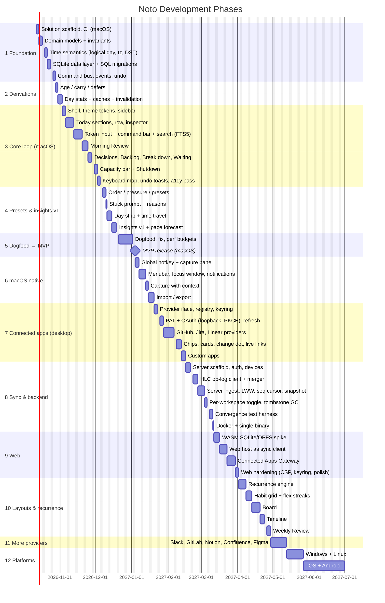

# Noto — Implementation Roadmap

Estimates are **focused working days for one developer**. Each phase's estimate excludes contingency; plan for **+20%** on top. The Gantt chart excludes weekends.

**Ordering principles:**

1. Build and dogfood the **daily loop** (Today → Review → Shutdown) on macOS before anything else. It's the product.
2. Connected Apps (desktop) come before Sync, because they don't depend on it.
3. Web comes after Sync and the Gateway, because it needs both.
4. Layouts beyond List come after the loop is proven.
5. Recurrence ships with the Habit layout that depends on it.

## Phase Overview

| Phase                      | Days | Cumulative | Milestone                                       |
| -------------------------- | ---- | ---------- | ----------------------------------------------- |
| 1 Foundation               | 12   | 12         |                                                 |
| 2 Derivations              | 4    | 16         |                                                 |
| 3 Core loop (macOS)        | 24   | 40         |                                                 |
| 4 Presets & insights v1    | 10   | 50         |                                                 |
| 5 Dogfood                  | 10   | 60         | **MVP (macOS)**: about 72 days with contingency |
| 6 macOS native             | 12   | 72         |                                                 |
| 7 Connected apps (desktop) | 19   | 91         | **v1.0 (macOS)**                                |
| 8 Sync & backend           | 18   | 109        |                                                 |
| 9 Web                      | 15   | 124        | **Web beta**                                    |
| 10 Layouts & recurrence    | 19   | 143        |                                                 |
| 11 More providers          | 10   | 153        |                                                 |
| 12 Platforms               | 35   | 188        | Windows/Linux/mobile                            |

Total ≈ 188 days, or ≈ 225 with contingency (about 11 months full-time solo). The MVP lands in about 3½ months.

---

## Phase 1: Foundation (12 days)

| Task                         | Output                                                               | Acceptance                                                                                                  |
| ---------------------------- | -------------------------------------------------------------------- | ----------------------------------------------------------------------------------------------------------- |
| Solution scaffold on .NET 10 | `Noto.sln`, projects per [05](05-architecture.md#solution-structure) | `dotnet build` and `dotnet test` green in CI (macOS runner)                                                 |
| Domain models                | `Noto.Core/Models`                                                   | Entities and invariants I1–I7 from [04](04-domain-model.md#21-todoitem), property-tested                    |
| Time semantics               | `Noto.Core/Time`                                                     | Logical-date tests cover day boundaries, travel, DST skip and repeat, events keeping their recorded zone    |
| Data layer                   | `Noto.Data` (Microsoft.Data.Sqlite)                                  | Migrations from an empty DB; repository round-trips; local-only vs synced tables separated                  |
| Command bus + events + undo  | `Noto.Core/Commands`                                                 | Every command writes state + event in one transaction; undo restores state and appends a compensating event |

## Phase 2: Derivations (4 days)

- Carry, age and defers exactly as specified, with tests for every row of [04 › 4.1](04-domain-model.md#41-age-carry-defers).
- Day stats, caches and invalidation from the earliest touched logical date.
- **Done when:** a seeded 365-day history computes Today in < 50ms and a full year of day stats in < 1s.

## Phase 3: Core Loop on macOS (24 days)

Delivers [07](07-ui-ux-design.md) §3–4, §7.1, §10–12: shell, Today sections, inspector, token input + ⌘K, search (SQLite FTS5), Morning Review, all decisions, Backlog, Break down, Waiting on, capacity bar, Shutdown, keyboard map, undo toasts, VoiceOver labels.

**Done when:**

- [ ] A 5-item Morning Review can be done with the keyboard alone in < 30s.
- [ ] Every decision is undoable.
- [ ] Rows read correctly in VoiceOver ("Deploy v2.3, planned, carried 4 times, estimate 1 hour").
- [ ] Both themes pass the contrast table in [07 › Tokens](07-ui-ux-design.md#111-tokens).

## Phase 4: Presets & Insights v1 (10 days)

Order strategies, pressure levels and presets (List layout only), stuck prompt and reasons, day strip, time travel, insights (size vs completion, weekday load, rollover trend, stuck mix) and the pace forecast.

## Phase 5: Dogfood → MVP (10 days)

Use it daily for two weeks. Fix what hurts and verify the performance budgets ([05](05-architecture.md#performance-budgets)).

**MVP scope:**

| In                                                                     | Out (later phase)                            |
| ---------------------------------------------------------------------- | -------------------------------------------- |
| macOS app, local SQLite                                                | Windows, Linux, mobile (12)                  |
| Workspaces, focus hours, Today (all)                                   | Global capture, menubar (6)                  |
| Today / Morning Review / Shutdown / Backlog / Someday                  | Connected apps (7)                           |
| Carry, pressure, stuck reasons, capacity, forecast                     | Sync, web (8, 9)                             |
| List layout with all presets that use it (Sprint, Zen, Accountability) | Board, Timeline, Habit grid, recurrence (10) |
| Insights v1, time travel, search                                       | Weekly Review (10)                           |

## Phase 6: macOS Native (12 days)

Global hotkey (Carbon `RegisterEventHotKey`), floating capture panel kept warm, menubar via `TrayIcon` + `NativeMenu`, always-on-top focus window, notifications, capture-with-context (Apple Events and Accessibility, with entitlements), import (Todoist, Things, Reminders, TickTick, Markdown) and JSON/CSV export.

**Done when:** hotkey → item saved in < 2s with the main window closed.

## Phase 7: Connected Apps, Desktop (19 days)

Provider interface and registry, keyring storage, PAT and OAuth (loopback + PKCE) with refresh, GitHub/Jira/Linear, chips, cards, change dot, live-link rules, custom apps. See [10](10-connected-apps.md).

**Done when:**

- [ ] GitHub PR, Jira issue and Linear issue URLs show chips within 2s cached / 5s on first fetch.
- [ ] A merged PR produces the "Done?" suggestion. A Waiting item auto-returns when its Jira ticket leaves a blocked status.
- [ ] Tokens exist only in the Keychain. They're absent from SQLite, exports and logs (verified by test).

## Phase 8: Sync & Backend (18 days)

Server (auth, devices, `/sync`, `/sync/snapshot`), HLC op-log client and merger, per-workspace toggle, tombstone GC, Docker image and single binary. See [05 › Sync](05-architecture.md#sync-architecture-when-enabled) and [06](06-api-design.md).

**Done when:**

- [ ] A randomized convergence test (3 replicas, 10k random ops, random partitions and clock skew) ends with identical state on all replicas, and no `different-field` edit is lost.
- [ ] Credentials and previews never appear in any op (asserted in the test suite).
- [ ] The app works fully offline with sync enabled.

## Phase 9: Web (15 days)

Starts with a 3-day **spike**: SQLite in WASM persisted to OPFS (IndexedDB fallback). If it fails the go/no-go, the fallback is an in-memory SQLite DB hydrated from `/sync/snapshot`, with the web app documented as online-first. Then: the web host as a sync client, the Connected Apps Gateway (OAuth broker, allowlisted fetch, SSRF-guarded OpenGraph) and CSP hardening.

## Phase 10: Layouts & Recurrence (19 days)

Recurrence engine (deterministic instances, task-like vs habit-like), Habit grid with flex streaks, Board (fixed + user columns, WIP limits), Timeline, Weekly Review. This completes the Deadline, Habit and Kanban presets.

## Phase 11: More Providers (10 days)

Slack (including the admin-approval flow), GitLab, Notion (share-with-integration hint), Confluence, Figma.

## Phase 12: Platforms (35 days)

Windows and Linux (hotkey, keyring, notifications; Wayland limitations documented), then iOS and Android (card-stack review, swipe gestures, widgets, share target).

---

## Risk Register

| Risk                                           | Impact                                                                       | Mitigation                                                                                                                         |
| ---------------------------------------------- | ---------------------------------------------------------------------------- | ---------------------------------------------------------------------------------------------------------------------------------- |
| Daily loop doesn't stick                       | Core premise fails                                                           | Dogfood phase before any expansion; opt-in metrics from [07 › Measuring](07-ui-ux-design.md#18-measuring-whether-the-design-works) |
| Avalonia feels non-native on macOS             | Users perceive it as low quality                                             | Budget polish in Phase 5; native menubar/hotkey/capture; test VoiceOver every release                                              |
| SQLite in WASM persistence                     | Web data loss or no offline support                                          | Phase 9 spike with a defined fallback (online-first web)                                                                           |
| Sync bugs                                      | Data loss erodes trust                                                       | Per-field LWW + HLC, a convergence harness in CI, conflict log for text fields                                                     |
| Embedded OAuth client secrets in native builds | A secret gets extracted and abused for phishing-style apps under Noto's name | PKCE, read-only minimal scopes, per-release rotation where supported, provider abuse monitoring; PAT path always available         |
| Slack/Atlassian org approval requirements      | Many target users can't connect                                              | Ship PAT-friendly providers first; approval-request flow; API-token fallback for Atlassian                                         |
| Provider API changes                           | Previews break                                                               | Recorded-fixture tests per provider, normalized `LinkState`, OpenGraph fallback                                                    |
| Provider rate limits                           | Stale or missing previews                                                    | Batching (GraphQL), cache-first, visible-first queue, backoff                                                                      |
| Gateway abuse (open proxy / SSRF)              | Security incident on hosted Noto                                             | Host allowlists, GET-only/read-only GraphQL, private-range blocking, per-user rate limits                                          |
| Global hotkey on Wayland                       | Quick capture unavailable on some Linux setups                               | Portal where available; documented system-shortcut fallback (`noto --capture`)                                                     |
| Scope creep                                    | Schedule slips                                                               | MVP scope table above; layouts and platforms stay behind the MVP milestone                                                         |
