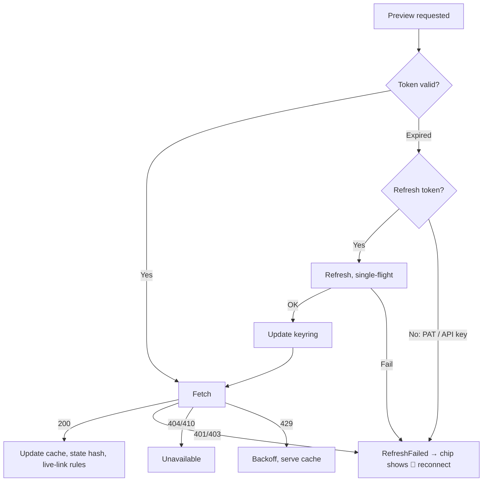

# Noto — Connected Apps & Live Links

## Overview

Noto connects to third-party apps (GitHub, Jira, Linear, Slack, GitLab, Notion, Confluence, …). When a todo's title or notes contain a URL from a connected app, Noto:

1. **Detects** the URL and matches it to a provider and a connection
2. **Fetches** live state via the provider's API, using credentials stored on the device
3. **Renders** a one-line **link chip** in the row and a full **preview card** in the inspector ([07 › Connected Apps](07-ui-ux-design.md#6-connected-apps-from-previews-to-live-links))
4. **Reacts** to state changes: a change dot, "Linked PR merged. Done?", auto-unblocking Waiting items ([Live Links](#live-links))

This is a core feature for the developer and manager personas.

---

## Core Principles

1. **Generic adapter system.** Providers implement one interface. Custom apps need no code.
2. **Credentials live in the device keyring.** On native clients, tokens are stored in the OS keyring and used directly against the provider. They're never synced, exported or logged.
3. **Web uses the Noto Gateway.** Browsers can't call provider APIs (CORS) or complete OAuth code exchanges, so the web client routes through the backend's stateless gateway ([Web](#web-connected-apps-gateway)).
4. **Previews are device-local.** Fetched content (Slack messages, ticket text) is private third-party data. It's cached per device and **never synced**. Only the URL (`todo_link`) syncs.
5. **Suggest, don't act.** State changes produce suggestions. Automatic changes (e.g. auto-complete) are opt-in per workspace, always reversible, and always visible in item history as "via GitHub".
6. **Graceful degradation.** If an app isn't connected or auth expired, the URL is still a plain clickable link.

---

## Platform Matrix

| Capability                    | macOS / Windows / Linux                   | iOS / Android                                   | Web (WASM)                                                    |
| ----------------------------- | ----------------------------------------- | ----------------------------------------------- | ------------------------------------------------------------- |
| Credential storage            | Keychain / Credential Manager / libsecret | Keychain / AndroidKeyStore                      | IndexedDB, encrypted with a non-extractable Web Crypto key    |
| OAuth                         | System browser + loopback redirect + PKCE | ASWebAuthenticationSession / Custom Tabs + PKCE | Gateway OAuth broker                                          |
| API calls                     | Direct HTTPS to provider                  | Direct HTTPS to provider                        | Via `/gateway/fetch` (needs a signed-in Noto backend)         |
| OpenGraph fallback            | Direct                                    | Direct                                          | Via `/gateway/opengraph`                                      |
| Intranet hosts (on-prem Jira) | Yes (device network)                      | Yes (device network)                            | Only via a **self-hosted** gateway with that host allowlisted |

Connections are per device. Signing in on a new device means reconnecting your apps. To make that quick, Settings › Connected Apps lists the providers that appear in your synced links ("Your items link to GitHub (34) and Jira (12). Connect them on this device?").

---

## User Flow

### Connecting an App

```
┌─ Settings › Connected Apps ─────────────────────────────────────┐
│                                                                  │
│  On this device                                                  │
│  ┌─────────────────────────────────────────────────────────┐    │
│  │  ● GitHub     achyutbadyal · PAT       last used 2m  ⋯  │    │
│  │  ● Jira       acme.atlassian.net       last used 1h  ⋯  │    │
│  │  ◐ Slack      acme-corp · reconnect needed           ⋯  │    │
│  └─────────────────────────────────────────────────────────┘    │
│                                                                  │
│  Available                                                       │
│  [ Linear ]  [ GitLab ]  [ Notion ]  [ Confluence ]  [ Figma ]   │
│                                                                  │
│  [ + Custom app (API key / bearer token) ]                       │
└──────────────────────────────────────────────────────────────────┘
```

Every provider offers the auth methods it supports:

- **OAuth** (one click): the system browser opens, the user authorizes, and Noto receives the code on a `http://127.0.0.1:<random port>/callback` loopback listener with a PKCE verifier. It exchanges the code and stores the tokens in the keyring.
- **Personal token** (PAT / API token / API key): paste it in. Noto validates it with a cheap "who am I" call and stores it in the keyring. This is the fastest path for developers, and the only one for some self-hosted tools.

### Pasting a URL into a Todo

```
User pastes:   https://github.com/noto/noto-app/pull/482   (into an empty add field)
Noto creates:  "Review: Add rich preview support (#482)"  ⟨GH #482 · 2✓ · CI ✓ · ready⟩
```

Pasting into an existing title or notes adds the link without changing the title.

---

## Provider Previews

Each provider defines **chip facts** (at most 3, chosen for actionability), a **state hash** (what counts as a meaningful change), and a **card** (full detail, shown in the inspector).

| Provider / object      | Chip facts                                      | State hash inputs                             | Card adds                                       |
| ---------------------- | ----------------------------------------------- | --------------------------------------------- | ----------------------------------------------- |
| GitHub PR              | approvals, CI status, mergeable / merged        | state, merged, review decision, CI conclusion | title, author, +/−, files, requested reviewers  |
| GitHub issue           | state, assignee, comments                       | state, assignee                               | labels, body excerpt                            |
| GitLab MR / issue      | as GitHub                                       | as GitHub                                     | pipeline, approvals                             |
| Jira issue             | status, assignee                                | status category, assignee                     | summary, priority, sprint, story points, labels |
| Linear issue           | status, assignee, cycle                         | state type, assignee                          | estimate, labels                                |
| Slack thread / message | channel, replies, **new since you last looked** | reply count, latest reply ts                  | parent message excerpt, participants            |
| Notion page            | last edited                                     | `last_edited_time`                            | breadcrumb, editor                              |
| Confluence page        | space, last edited                              | version number                                | breadcrumb, editor                              |
| Figma file             | last modified                                   | `lastModified`                                | thumbnail, page name                            |
| OpenGraph / custom     | site name                                       | none (no live state)                          | og:title, og:description, og:image              |

**Card example (inspector):**

```
┌─ GitHub Pull Request ─────────────────────────────────┐
│  noto/noto-app #482                                    │
│  Add rich preview support for connected apps           │
│  achyutbadyal · +342 / −28 · 3 files                   │
│  CI passed · 2 approvals · no conflicts                │
│  Open · ready to merge                      ↗ Open     │
└────────────────────────────────────────────────────────┘
```

**Slack specifics:** a thread uses `conversations.replies` (not `conversations.history`), plus `users.info` for names. Slack has **no "resolved" state** for threads. Noto shows reply counts and "new since you last looked" instead. Optionally, a workspace setting treats a ✅ reaction on the parent message as "resolved".

---

## Live Links

Live links build on previews: a linked object's state changes can affect the todo.

| Linked object event                                                       | Behavior                                                                                                                                                  |
| ------------------------------------------------------------------------- | --------------------------------------------------------------------------------------------------------------------------------------------------------- |
| Any meaningful change (state hash differs from what the user last viewed) | Change dot on the chip                                                                                                                                    |
| PR merged / issue or ticket closed (status category Done)                 | "Linked PR merged. Done?" suggestion in the row, inspector and Morning Review. With per-workspace opt-in, it completes the item automatically, with undo. |
| Waiting item whose link leaves a blocked/review state, or gets merged     | Moves back to Planned for today ("PROJ-1234 unblocked. Back on today."). `WaitingEnded {via: "link"}`.                                                    |
| Linked object deleted / access revoked                                    | Chip shows _unavailable_ with a "remove link" action                                                                                                      |

Every applied change records a `LinkStateChanged` event with a deterministic id ([04 › ItemEvent](04-domain-model.md#24-itemevent-append-only-history)). Two devices that both observe the change produce one event after sync.

**When state is checked:** when an item becomes visible, when Today or Review opens, and every 15 minutes in the foreground for items in **Waiting** or **Planned today** with links. Nothing polls in the background on mobile. Push via webhooks would need public endpoints and is out of scope.

---

## Provider Architecture

### `IAppProvider`

```csharp
public interface IAppProvider
{
    string ProviderId { get; }                      // "github"
    string DisplayName { get; }
    string IconPath { get; }
    IReadOnlyList<UrlPattern> UrlPatterns { get; }  // host + path templates (see registry)
    IReadOnlyList<AuthMethod> SupportedAuthMethods { get; }
    AuthConfig GetAuthConfig();                     // OAuth endpoints, scopes, PAT help URL

    bool CanHandle(Uri url, AppConnection? connection);    // connection resolves instance hosts
    Task<ConnectionIdentity> ValidateAsync(IProviderHttp http);           // "who am I"
    Task<LinkPreview> FetchAsync(Uri url, IProviderHttp http, CancellationToken ct);
    Task<IReadOnlyList<LinkPreview>> FetchBatchAsync(IReadOnlyList<Uri> urls, IProviderHttp http, CancellationToken ct); // GraphQL batching etc.
}
```

`IProviderHttp` is the transport. `DirectTransport` (native) attaches the keyring token and calls the provider. `GatewayTransport` (web) sends the request to `/gateway/fetch` with the token in `X-Provider-Authorization`. Providers don't know which one they're using.

### Matching URLs to connections

A user can have several connections for one provider (two Slack workspaces, GitHub.com + GitHub Enterprise). The URL host picks the connection: `acme-corp.slack.com` → the Slack connection whose team domain is `acme-corp`, and `jira.acme.com` → the Jira connection with that `instance_url`. If no connection matches, the URL is a plain link with a "Connect Jira (jira.acme.com)" hint.

### LinkPreview (local-only cache)

```csharp
public sealed class LinkPreview
{
    public string Url { get; init; } = "";          // normalized; cache key
    public string ProviderId { get; init; } = "";
    public Guid? ConnectionId { get; init; }
    public string Title { get; set; } = "";
    public string? Subtitle { get; set; }           // "noto/noto-app #482", "PROJ-1234", "#design-reviews"
    public IReadOnlyList<ChipFact> ChipFacts { get; set; } = [];
    public string? Snippet { get; set; }
    public string? AuthorName { get; set; }
    public string? AuthorAvatarUrl { get; set; }
    public LinkState? State { get; set; }           // normalized: Open, InProgress, InReview, Blocked, Done, Closed, Unknown
    public string? StateHash { get; set; }
    public Dictionary<string, JsonElement> Metadata { get; set; } = new();
    public DateTimeOffset FetchedAt { get; set; }
    public DateTimeOffset? ExpiresAt { get; set; }
    public PreviewStatus Status { get; set; }       // Loading, Loaded, Stale, Error, AuthRequired, Unavailable
    public string? ErrorMessage { get; set; }
}
```

`LinkState` is normalized across providers, which is what lets live-link rules be written once: Jira status categories, Linear state types and GitHub PR states all map to it.

### Detection pipeline

```
Title / notes changed ─► URL scanner ─► normalize ─► todo_link rows (synced)
                                                   │
                                                   ▼
                           ProviderRegistry.match(url) → (provider, connection?)
                                                   │
                                                   ▼
                 PreviewService: cache-first ─► debounce 500ms ─► per-provider rate-limited queue
                         (visible rows first, then Waiting/Today, then the rest; batch where the API allows)
                                                   │
                                                   ▼
                link_preview_cache (local) ─► chip + card ─► live-link rules (state hash diff)
```

---

## Credential Storage

**Native:** each connection's secret material (`access_token`, `refresh_token`, `expires_at`, or API key) is stored as one keyring item:

| Platform | Store                                                                                                                    |
| -------- | ------------------------------------------------------------------------------------------------------------------------ |
| macOS    | Keychain (`kSecClassGenericPassword`, service `app.noto.connections`, account `<connection id>`)                         |
| Windows  | Credential Manager (DPAPI-protected), target `app.noto.connections/<connection id>`                                      |
| Linux    | Secret Service (libsecret). If no Secret Service is running, Noto refuses to store tokens and explains how to enable it. |
| iOS      | Keychain, `kSecAttrAccessibleAfterFirstUnlockThisDeviceOnly`                                                             |
| Android  | AndroidKeyStore-wrapped key encrypting an app-private file                                                               |

The keyring is the encryption. There's no separate `credentials.enc` file or Noto-managed key. Non-secret metadata lives in the local-only `app_connection` table ([04](04-domain-model.md#6-links)).

**Web:** secrets are stored in IndexedDB, encrypted with an AES-GCM key generated as **non-extractable** by Web Crypto. That protects data at rest, but not against script injection on the page, so the web build ships with a strict Content Security Policy and no third-party scripts.

### Credential model

```csharp
public sealed class AppConnection          // local-only table; secrets are in the keyring
{
    public Guid Id { get; init; }
    public string ProviderId { get; init; } = "";
    public AuthMethod AuthMethod { get; init; }        // OAuth2, PersonalToken, ApiKey, BasicAuth
    public string DisplayLabel { get; set; } = "";     // "acme-corp", "achyutbadyal"
    public string? InstanceUrl { get; set; }           // self-hosted / per-tenant host
    public string[] Scopes { get; set; } = [];
    public DateTimeOffset ConnectedAt { get; init; }
    public DateTimeOffset? LastUsedAt { get; set; }
    public ConnectionStatus Status { get; set; }       // Active, Expired, RefreshFailed, Revoked
}
```

### OAuth details & known trade-offs

- **Native OAuth** follows RFC 8252 (OAuth for native apps): system browser, loopback redirect, PKCE. Providers whose token exchange requires a `client_secret` (Slack, Atlassian, GitHub OAuth Apps) get one **embedded in the native build**. RFC 8252 treats native clients as public, so this secret should be assumed extractable. Mitigations: PKCE everywhere it's supported, minimal read-only scopes, per-release secret rotation where the provider allows it, and abuse monitoring on the provider dashboards. The secret alone grants no access to any user's data.
- **Token refresh:** before expiry, under a single-flight lock per connection. On failure → `RefreshFailed` → chips show `🔑 reconnect`.
- **Disconnect:** revokes at the provider where an API exists, then deletes the keyring item and the connection's cached previews.



### Organizational approval

- **Slack:** reading threads needs a Slack app installed in the user's workspace. Many company workspaces require **admin approval** for third-party apps. The connect flow detects the "approval required" response and shows "Your Slack admin needs to approve Noto. [Copy request message]". Slack ships after GitHub, Jira and Linear for this reason.
- **Notion:** integrations only see pages explicitly shared with them. A Notion URL the integration can't see shows as "Share this page with Noto in Notion to see live status" with a how-to link.
- **Jira/Confluence Cloud OAuth (3LO)** may also be restricted by org admins. Atlassian API tokens (personal) work as the fallback.

---

## Web: Connected Apps Gateway

The web client is a normal local-first sync client ([06](06-api-design.md)). For connected apps it needs the backend:

```
Browser (WASM)                              Noto backend                       Provider
──────────────                              ────────────                       ────────
POST /gateway/oauth/github/start  ───────►  authorize_url (+state, PKCE)
open popup ─────────────────────────────────────────────────────────────────►  user consents
                                            /callback ◄─────────────────────── code
                                            exchange code (server-held secret) ──► tokens
popup receives one-time code ◄────────────  (tokens not persisted)
POST /gateway/oauth/github/redeem ────────► tokens ─► stored in IndexedDB (encrypted)

POST /gateway/fetch  {provider, request}
  X-Provider-Authorization: Bearer <token> ─► allowlist check ─► forward ────────► API
                                            ◄─ status + body (not logged/stored) ◄─
```

Properties:

- The gateway is **stateless with respect to credentials**. Tokens pass through it in memory on each request and are never written to disk, the database or logs. This differs from native clients, where tokens never leave the device, and the web connect screen says so: _"On the web, requests to GitHub pass through your Noto server. Tokens are not stored there."_
- **Self-hosters** run the same gateway with their own provider OAuth apps (env vars in [06 › Self-Hosting](06-api-design.md#self-hosting)), so their tokens only pass through their own server.
- The web client without a signed-in backend has no connected apps. Links render as plain links with a hint.
- Allowlists, read-only enforcement, SSRF guards and rate limits: [06 › Gateway rules](06-api-design.md#connected-apps-gateway-web-client).

---

## Preview Caching & Refresh

| Provider / object      | Cache TTL | Refresh trigger                                                             |
| ---------------------- | --------- | --------------------------------------------------------------------------- |
| Slack thread           | 5 min     | Item visible, Review opened, manual                                         |
| GitHub / GitLab PR, MR | 5 min     | Visible; 15-min foreground cycle while the item is Waiting or Planned today |
| GitHub / GitLab issue  | 15 min    | Visible                                                                     |
| Jira / Linear issue    | 10 min    | Visible; 15-min cycle while Waiting or Planned today                        |
| Notion / Confluence    | 30 min    | Visible                                                                     |
| Figma                  | 30 min    | Visible                                                                     |
| OpenGraph / custom     | 24 h      | Manual                                                                      |

Previews live in the local-only `link_preview_cache`, keyed by normalized URL. Stale previews render immediately and refresh in the background. Disconnecting an app clears its cached previews.

---

## Custom App Support

```
┌─ Add Custom App ───────────────────────────────────────┐
│  App name:      [ Internal Wiki              ]          │
│  URL pattern:   [ wiki.acme.com/pages/*      ]          │
│  Auth:          [ Bearer token          ▾ ]             │
│  Token:         [ ••••••••••••••••••••  👁 ]  (keyring) │
│                                                         │
│  Preview:  ○ OpenGraph   ● JSON API                     │
│  Endpoint:      [ https://wiki.acme.com/api/v1/pages/{path} ] │
│  Title:         [ $.title     ]   Snippet: [ $.excerpt ] │
│  State:         [ $.status    ]   Done when: [ archived ] │
│                                                         │
│  [ Test with a URL… ]                 [ Save ] [ Cancel ]│
└─────────────────────────────────────────────────────────┘
```

- Bearer token, API key (header or query) or basic auth. Secrets go to the keyring.
- URL pattern: glob, with `{path}`/`{id}` captures available to the endpoint template.
- Optional **State** + **Done when** mapping turns a custom app into a live link (normalized `LinkState`).
- "Test with a URL" fetches a sample and shows the resulting chip and card.
- Custom app definitions (not secrets) can be exported as JSON to share with a team.

---

## Built-in Provider Registry

### v1 (desktop)

| Provider | Auth methods                                    | URL patterns                                                              | API                                 |
| -------- | ----------------------------------------------- | ------------------------------------------------------------------------- | ----------------------------------- |
| GitHub   | Fine-grained PAT, OAuth (PKCE), device flow     | `github.com/{o}/{r}/pull/{n}`, `/issues/{n}`, `/commit/{sha}`; GHES hosts | GraphQL v4 (batched), REST fallback |
| Jira     | API token (Cloud), PAT (Data Center), OAuth 3LO | `{site}.atlassian.net/browse/{KEY}`, `{host}/browse/{KEY}`                | REST v3 / v2 (DC)                   |
| Linear   | Personal API key, OAuth (PKCE)                  | `linear.app/{team}/issue/{ID}/…`                                          | GraphQL (batched)                   |

### v1.x

| Provider   | Auth methods         | URL patterns                                                                                  |
| ---------- | -------------------- | --------------------------------------------------------------------------------------------- |
| Slack      | OAuth (user token)   | `{team}.slack.com/archives/{channel}/p{ts}` (thread via `thread_ts` query param when present) |
| GitLab     | PAT, OAuth (PKCE)    | `{host}/{group}/{project}/-/merge_requests/{n}`, `/-/issues/{n}`                              |
| Notion     | OAuth                | `notion.so/…-{id}`, `{workspace}.notion.site/…-{id}`                                          |
| Confluence | API token, OAuth 3LO | `{site}.atlassian.net/wiki/spaces/{space}/pages/{id}/…`                                       |
| Figma      | PAT, OAuth           | `figma.com/design/{key}/…`, `figma.com/file/{key}/…`, `figma.com/board/{key}/…`               |
| Asana      | PAT, OAuth           | `app.asana.com/0/{project}/{task}`, `app.asana.com/1/{workspace}/project/{p}/task/{t}`        |
| Trello     | API key + token      | `trello.com/c/{id}`                                                                           |

### Community providers (later)

A provider is a class implementing `IAppProvider`, shipped in the app. Loading third-party provider assemblies at runtime isn't possible on iOS (no dynamic code) and is a supply-chain risk elsewhere. Community providers are contributed upstream, or expressed as **declarative custom-app definitions** (JSON) that need no code.

---

## Error States & UX

| State           | Chip                                 | Card / action                                 |
| --------------- | ------------------------------------ | --------------------------------------------- |
| Loading         | Shimmer chip                         | Skeleton card                                 |
| Loaded          | Facts                                | Full card                                     |
| Stale           | Facts (cached)                       | "Updated 12m ago", refreshing                 |
| AuthRequired    | `⟨ Slack · 🔑 reconnect ⟩`           | Reconnect button (deep-links to Settings)     |
| Error (API)     | Cached facts if any, plus a ⚠ glyph  | Error text + Retry                            |
| Error (network) | Cached facts if any, else plain link | Auto-retry on connectivity                    |
| Unavailable     | Struck-through chip                  | "No longer accessible" + Remove link          |
| No connection   | Plain link                           | One-time hint: "Connect Jira for live status" |
| Web, signed out | Plain link                           | "Sign in to Noto Sync for live links"         |

---

## Rate Limiting & Quotas

| Provider | Published limit (approx.)                | Noto strategy                                          |
| -------- | ---------------------------------------- | ------------------------------------------------------ |
| GitHub   | 5,000 req/h REST; GraphQL point budget   | GraphQL batch up to 50 objects per query; ETag on REST |
| Jira     | Cost-based, per user                     | 10-min cache; JQL `key in (…)` batching                |
| Linear   | Complexity-based                         | GraphQL batching                                       |
| Slack    | `conversations.replies` Tier 3 (~50/min) | 5-min cache, visible-first queue                       |

**Global:** a rate-limited queue per provider and connection, exponential backoff with jitter on 429 (honoring `Retry-After`), cached data served on any failure, and priority ordering (visible → Waiting/Today → rest).
